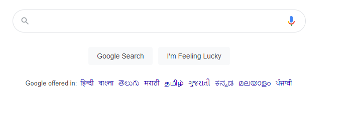
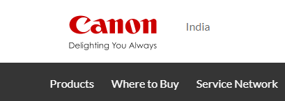

# Dom Manipulation Assignment

1. Webiste Name: [Dev To](https://dev.to/)

### Topics

    - Query Selctory, Inner HTML

### Sample Image


### Tasks

        Target the Top description div and change the DEV Community to <Your_Name> and description to your passion

### Output


### Code
```
document.querySelector(".side-bar .crayons-card .crayons-subtitle-2").innerHTML = "Paras Jogani"

document.querySelector(".side-bar .crayons-card .color-base-70").innerHTML = "I Write Code"
```
### Change OUTPUT


2. Website Name: [Apple](https://support.apple.com/en-in)

### Task


### Fetch all the product name and store in an array

### Output

['iPhone', 'Mac', 'iPad', 'Watch', 'AirPods', 'Music', 'TV']

### Code
```
let arr = [];
document.querySelectorAll(".as-imagegrid-item").forEach((e) => {arr.push(e.innerText.replace("\nSupport", ""))})
console.log(arr)
```

### Change OUTPUT


3. Webiste Name: [Youtube Support](https://support.google.com/youtube/)

### Topics

    - Get Element By Id, Create Element, Create Text Node, Append Child

### Sample Image


### Tasks

     Add another FAQ 'My New FAQ' to the list

### Output


### Code
```
const conid = document.getElementById("hcfe-content");

const path = document.querySelector(".primary-container .page-width-container .main-content .article .accordion-homepage");
const newsec = document.createElement("section");
newsec.className = "parent";
newsec.innerHTML = "<h3>My New FAQ</h3>";
path.append(newsec)

```

### Change OUTPUT


4. Webiste Name: [OnePlus](https://www.oneplus.in/support)

### Topics

     Query Selector, InnerText

### Sample Image


### Tasks

      Change the contact number

### Output


### Code

```
document.querySelector(".customer-support .service-number").innerText = "+91 9887766554";

```

### Change OUTPUT


5. Webiste Name: [Samsung](https://www.samsung.com/in/offer/online/samsung-fest/)

### Topics

       getElementById, createElement, InnerText, append, setAttribute

### Sample Image


### Tasks

     Target the main div of card and change the Button text to Check out

### Output


### Code

```
document.querySelector(".mytabs .diwali-deals-product-sale-pro .diwali-deals-product-sale-btn").innerText = "Check Out";
```

### Change OUTPUT


6. Webiste Name: [Adidas](https://www.adidas.co.in/)

### Topics

    -   Query Selector, Event listeners, Changing Styles

### Sample Image


### Tasks

     Target the search box and on hover change thebackground color to red.

### Output


### Code

```
document.querySelector(".searchinput___19uW0").addEventListener("mouseover", function() {document.querySelector(".searchinput___19uW0").style.backgroundColor = "red"});
```

### Change OUTPUT


7. Webiste Name: [MDN Web Docs](https://developer.mozilla.org/en-US/)

### Topics

       Form, Value, Submit

### Sample Image


### Tasks

     To Search a topic in the MDN Search bar.
     First add a text to search in the search bar and then hit the submit search button to search the docs using DOM

### Output


### Code
```
function search(t){
     let input = document.querySelector("#hp-search-input"); 
     input.value = t; 
     let form = document.querySelector("#hp-search-form"); 
     form.submit();
     }
search("Css Selector");
```

### Change OUTPUT


8. Webiste Name: [Google](https://www.google.com/)

### Topics

       Remove Elements

### Sample Image



### Tasks

     Remove alternate languages from the home page languages listed

### Output


### Code

```
let total = document.querySelectorAll("#SIvCob a");
for(i = 0; i < total.length; i++){
     if (i % 2 == 0){
          total[i].remove()
          }
     }
```

### Change OUTPUT


9. Webiste Name: [Code Wars](https://www.codewars.com/)

### Topics

       Change Font Family, Color of Text.

### Sample Image


### Tasks

    Change the font family of the text to monospace and text color to the logo’s background color.

### Output


### Code
```
document.querySelector(".display-heading-1").style.color = "#b1361e";
document.querySelector(".display-heading-1").style.fontFamily = "monospace";
```

### Change OUTPUT


10. Webiste Name: [Freecodecamp](https://www.freecodecamp.org/)

### Topics

       querySelector, mouseover, click eventListener,  callback function, style,

### Sample Image


### Tasks

    Target the button and change background colour on mouseover

### Output


### Code

```
document.querySelector(".btn-cta-big .login-btn-text").addEventListener("mouseover", function(){
     document.querySelector(".btn-cta-big .login-btn-text").style.backgroundColor = "red";
     })
```

### Change OUTPUT


11. Webiste Name: [realme](https://www.realme.com/in/)

### Topics

       querySelector,style,background-image

### Sample Image


### Tasks

    change the realme logo to ineuron logo

### Output


### Code

```
document.querySelector(".logo .icon-logo").style.backgroundImage = "url('https://ineuron.ai/images/ineuron-logo.png')";
```

### Change OUTPUT


12. Webiste Name: [Github](https://github.com/)

### Topics

       querySelector,style,background-Color

### Sample Image


### Tasks

     change the background colour of the button to blue.

### Output


### Code

```
document.querySelector(".btn-primary").style.backgroundColor = "Blue";
```

### Change OUTPUT


13. Webiste Name: [Hackerrank](https://www.hackerrank.com/)

### Topics

       querySelector,innerHtml

### Sample Image


### Tasks

Target the top description and change “Matching developers with great companies” to ‘JSBOOTCAMP“.

### Output


### Code

```
document.querySelector(".fl-heading-text").innerText = "JSBOOTCAMP";
```

### Change OUTPUT


14. Webiste Name: [Asus](https://www.asus.com/in/)

### Topics

      querySelector,style,font-size

### Sample Image


### Tasks

       change the fontsize of “Hot Deals” to 80px

### Output


### Code

```
document.querySelector(".HotDealsAll__Heading__2fIbe").style.fontSize = "80px";
```

### Change OUTPUT


15. Webiste Name: [Dell](https://www.dell.com/en-in/shop/deals/laptop-deals?gacd=10415953-9016-5761040-285981356-0&dgc=ST&gclid=Cj0KCQjwguGYBhDRARIsAHgRm4-XUDMhhVNyHXb3s1gY4ZBzORr_d9Se-buhJwy7asyUe7YdqEA11eEaAt6UEALw_wcB&gclsrc=aw.ds&nclid=BxjBlpBQsX6pjSHh-L8YYSU77EpfXRkG1AGMB5Wbeu386ykspfrPDnfx_DdFau20)

### Topics

      querySelector,style.textAlign

### Sample Image


### Tasks

       Convert the text “G15 Gaming Laptop” from left to right

### Output


### Code

```
document.querySelector(".ps-title").style.textAlign = "right";
```

### Change OUTPUT


16. Webiste Name: [Vercel](https://vercel.com/)

### Topics

     querySelector,innerHTMl

### Sample Image


### Tasks

      change the heading “Start with the developer” to “Start with Scratch”

### Output


### Code

```
document.querySelector(".section-title_title__VEDfK").innerText = "Start With Scratch";
```

### Change OUTPUT


17. Webiste Name: [Sony](https://www.sony.co.in/)

### Topics

    querySelector,innerHTMl

### Sample Image


### Tasks

     change the button text To current Date.

### Output


### Code

```
document.querySelector(".btn-container").innerHTML = new Date;
```

### Change OUTPUT


18. Webiste Name: [Philips](https://www.philips.co.in/)

### Topics

     querySelector,style,backgroundcolor

### Sample Image


### Tasks

    change the background colour blue to orange

### Output


### Code

```
document.querySelector(".p-f03-footer-container").style.background = "orange";
```

### Change OUTPUT


19. Webiste Name: [Canon](https://in.canon/)

### Topics

          querySelector,src

### Sample Image



### Tasks

    extract the canon logo

### Output


### Code

```
document.querySelector(".navbar-brand .logo").innerText = "https://in.canon/assets/brand/logo-300-002e45a4aec98fd92899838da9d5560f.png";
```

### Change OUTPUT


20. Webiste Name: [Oppo](https://www.oppo.com/in/)

### Topics

          querySelector,style,color

### Sample Image


### Tasks

      Change the description colour black to orange

### Output


### Code

```
document.querySelector(".desc").style.color = "orange";
```

### Change OUTPUT


